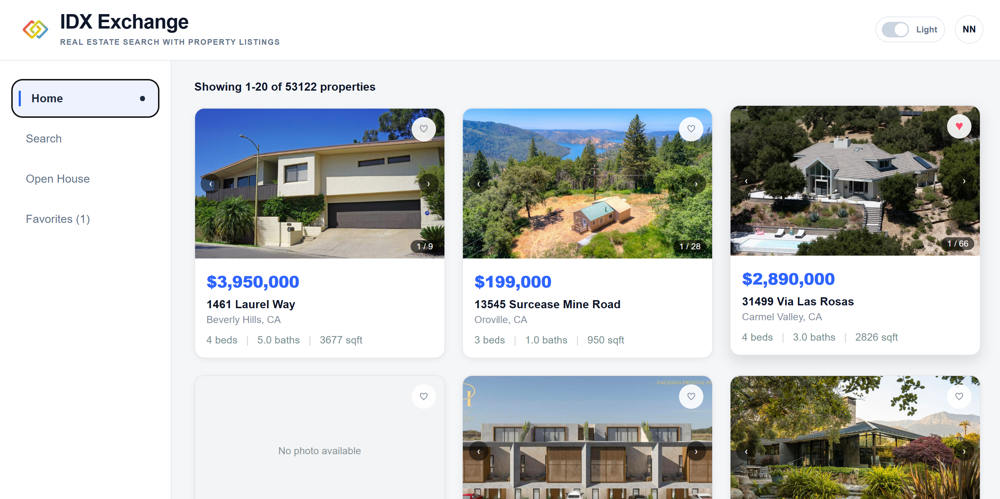
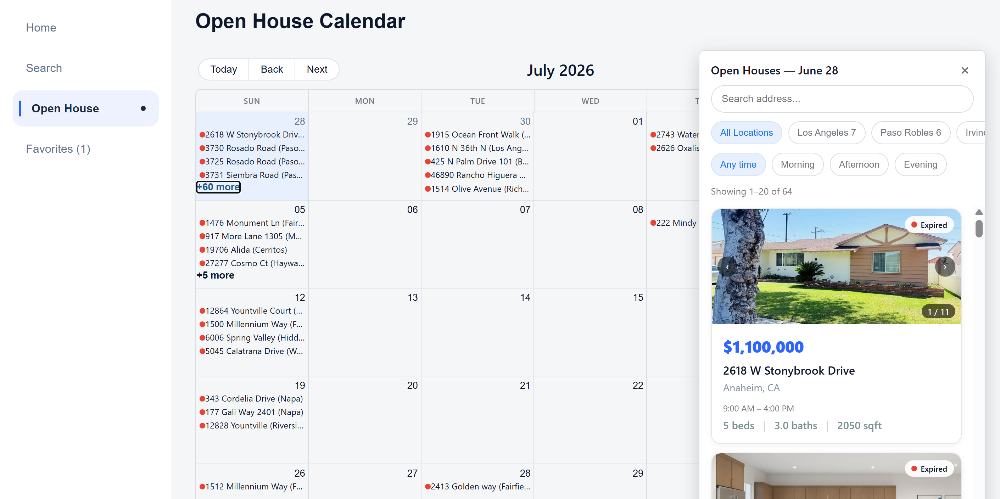

# IDX Exchange

A full-stack real-estate search application for browsing IDX listings, filtering properties, viewing listing details, and finding upcoming open houses.


## Project description

IDX Exchange is a property-search web app built for browsing and filtering residential listings from an existing RETS/MySQL data source. It combines a React frontend with an Express API that queries MySQL for listing data and open-house records.

The app includes:
- A searchable listing grid with filter, sort, and pagination support
- Property detail pages with gallery, listing facts, and map embed support
- Open house calendar and listing-level open house views
- Local favorites tracking for saved properties
- A backend API with validation and structured error responses

## App preview

## App Preview





## Tech stack

| Layer | Technology | Version / notes |
| --- | --- | --- |
| Frontend | React | 19.2.7 |
| Frontend router | React Router | 7.18.2 |
| Frontend build tool | Create React App / react-scripts | 5.0.1 |
| Backend | Node.js | 18+ recommended |
| Backend framework | Express | 5.2.1 |
| Database driver | mysql2 | 3.22.5 |
| Environment config | dotenv | 17.4.2 |
| API cross-origin support | cors | 2.8.6 |
| Testing | Jest | 30.5.0 |
| API testing | Supertest | 7.2.2 |
| Frontend testing | @testing-library/react | 16.3.2 |
| Database | MySQL | 5.7+ / 8.0 compatible |

## Repository structure

```text
.
├── backend/
│   ├── migrations/
│   │   └── 001_add_indexes.sql
│   ├── server/
│   │   ├── app.js
│   │   ├── server.js
│   │   ├── config/
│   │   │   └── db.js
│   │   ├── middleware/
│   │   │   └── requestLogger.js
│   │   ├── routes/
│   │   │   ├── health.js
│   │   │   ├── openhouses.js
│   │   │   └── properties.js
│   │   └── test/
│   │       ├── properties.test.js
│   │       └── properties.integration.test.js
│   ├── notes.md
│   └── package.json
├── frontend/
│   ├── public/
│   ├── src/
│   │   ├── api/
│   │   ├── components/
│   │   ├── hooks/
│   │   ├── pages/
│   │   ├── utils/
│   │   ├── App.js
│   │   ├── index.js
│   │   └── setupTests.js
│   └── package.json
├── README.md
└── package.json
```

## Architecture overview

```text
Browser
  │
  ├─ React Router pages
  │    ├─ Listings page
  │    ├─ Property detail page
  │    ├─ Open house calendar
  │    └─ Favorites page
  │
  └─ frontend/src/api/client.js
        │
        ▼
Express API on port 5000
  ├─ /api/health
  ├─ /api/properties
  ├─ /api/properties/:id
  ├─ /api/properties/:id/openhouses
  └─ /api/openhouses
        │
        ▼
MySQL database
  ├─ rets_property
  └─ rets_openhouse
```

### Frontend responsibilities
- Loads property lists, filters, and pagination state
- Uses the API client for all network calls
- Renders property cards, gallery images, map embeds, and open-house calendar views
- Saves favorites in browser state and exposes them through the app outlet context

### Backend responsibilities
- Validates query parameters before executing database queries
- Enforces pagination bounds and basic filtering constraints
- Returns structured JSON errors for invalid requests
- Reads from the legacy RETS-style MySQL tables and joins open-house data when needed

## Prerequisites

Before you start, make sure you have:
- Node.js 18 or newer (20 LTS recommended)
- npm
- A running MySQL instance with the required tables already created and populated
- Git
- Optional: a Google Maps API key for property-location embeds

> This repository does not create or seed the database for you. The app expects an existing MySQL schema with matching property and open-house tables.

## Fresh-machine setup

### 1) Clone the repository

```bash
git clone <your-repository-url>
cd idx-exchange-sde-intern
```

### 2) Install dependencies

From the project root, install both apps separately:

```bash
cd backend
npm install

cd ../frontend
npm install
```

### 3) Prepare MySQL

Create or select a database and make sure the required tables are present.

The application expects these tables in MySQL:
- `rets_property`
- `rets_openhouse`

At minimum, the app relies on columns such as:
- `L_ListingID`
- `L_City`
- `L_Zip`
- `L_SystemPrice`
- `L_Keyword2`
- `LM_Dec_3`
- `OpenHouseDate`
- `OH_StartTime`
- `OH_EndTime`

If your database does not yet include the required indexing and normalized city field, run the migration script included in the repo:

```bash
mysql -u your_mysql_user -p your_database_name < backend/migrations/001_add_indexes.sql
```

The script adds the generated column `city_normalized` and improves query performance for city and open-house lookups.

### 4) Create environment files

Create a `backend/.env` file using your local database credentials:

```env
PORT=5000
DB_HOST=127.0.0.1
DB_PORT=3306
DB_USER=root
DB_PASSWORD=your_mysql_password
DB_NAME=idx_exchange
```

Create an optional `frontend/.env` file for Google Maps embedding:

```env
REACT_APP_GOOGLE_MAPS_API_KEY=your_google_maps_api_key
```

If you do not need the map embed, you can skip this file. The app will still run without it, but the map section may not render.

### 5) Start the backend

Open a terminal in the backend directory:

```bash
cd backend
npm run dev
```

This starts the Express server with nodemon. By default, the backend listens on:
- `http://localhost:5000`

### 6) Start the frontend

Open a second terminal in the frontend directory:

```bash
cd frontend
npm start
```

This starts the React development server on:
- `http://localhost:3000`

The frontend is configured with a proxy to `http://localhost:5000`, so browser requests to `/api/*` are forwarded to the backend automatically.

### 7) Open the app

Visit:

```text
http://localhost:3000
```

## Common commands

### Backend

```bash
cd backend
npm run dev    # development server with nodemon
npm start      # production-like start using node
npm test       # run backend Jest tests
```

### Frontend

```bash
cd frontend
npm start      # development server
npm run build  # production build
npm test       # run frontend tests
npm run test:ci # CI coverage run
```

## API reference

Base URL:

```text
http://localhost:5000
```

### Health check

#### GET /api/health

Checks whether the server can reach MySQL.

Example request:

```bash
curl http://localhost:5000/api/health
```

Example success response:

```json
{
  "status": "ok",
  "database": "connected"
}
```

Example failure response:

```json
{
  "status": "error",
  "database": "disconnected"
}
```

### List properties

#### GET /api/properties

Returns a paginated and filtered list of listings.

Query parameters:

| Name | Type | Description |
| --- | --- | --- |
| `city` | string | Exact city match after trimming |
| `zipcode` | string | Exact ZIP-code match |
| `minPrice` | number | Minimum price filter |
| `maxPrice` | number | Maximum price filter |
| `beds` | integer | Minimum bedroom requirement |
| `baths` | integer | Minimum bathroom requirement |
| `limit` | integer | Page size, default `20`, max `100` |
| `offset` | integer | Zero-based offset, default `0` |

Example request:

```bash
curl "http://localhost:5000/api/properties?city=Austin&minPrice=400000&beds=3&limit=10&offset=0"
```

Example response:

```json
{
  "total": 42,
  "limit": 10,
  "offset": 0,
  "results": [
    {
      "L_ListingID": "1001",
      "L_Address": "123 Main St",
      "L_City": "Austin",
      "L_State": "TX",
      "L_Zip": "78701",
      "L_SystemPrice": 725000,
      "L_Keyword2": 4,
      "LM_Dec_3": 3,
      "L_Photos": "[]",
      "L_DisplayId": "ABC-1001"
    }
  ]
}
```

### Get one property by listing ID

#### GET /api/properties/:id

Returns the full property row for the matching `L_ListingID`.

Example request:

```bash
curl http://localhost:5000/api/properties/1001
```

Example response:

```json
{
  "L_ListingID": "1001",
  "L_Address": "123 Main St",
  "L_City": "Austin",
  "L_State": "TX",
  "L_Zip": "78701",
  "L_SystemPrice": 725000,
  "L_Keyword2": 4,
  "LM_Dec_3": 3,
  "LM_Int2_3": 2400,
  "L_Photos": "[]"
}
```

### Get open houses for a property

#### GET /api/properties/:id/openhouses

Returns all open-house events for a listing, ordered by date and start time.

Example request:

```bash
curl http://localhost:5000/api/properties/1001/openhouses
```

Example response:

```json
[
  {
    "L_ListingID": "1001",
    "OpenHouseDate": "2026-08-23",
    "OH_StartTime": "13:00:00",
    "OH_EndTime": "15:00:00",
    "all_data": "{\"OpenHouseRemarks\":\"Hosted by the listing agent\"}"
  }
]
```

### List open houses by date and optional filters

#### GET /api/openhouses

Returns open-house records in a date window with optional property filters applied.

Example request:

```bash
curl "http://localhost:5000/api/openhouses?startDate=2026-08-01&endDate=2026-08-31&city=Austin&minPrice=400000"
```

Example response:

```json
[
  {
    "L_ListingID": "1001",
    "OpenHouseDate": "2026-08-23",
    "OH_StartTime": "13:00:00",
    "OH_EndTime": "15:00:00",
    "L_Address": "123 Main St",
    "L_City": "Austin",
    "L_State": "TX",
    "L_Zip": "78701",
    "L_SystemPrice": 725000,
    "L_Keyword2": 4,
    "LM_Dec_3": 3,
    "L_Photos": "[...]",
    "all_data": "{\"OpenHouseRemarks\":\"Hosted by the listing agent\"}"
  }
]
```

### Error handling

The API returns JSON error objects with an `error` field for invalid requests or missing resources.

Example invalid request:

```bash
curl "http://localhost:5000/api/properties?limit=0"
```

Example response:

```json
{
  "error": "Invalid limit: must be an integer between 1 and 100"
}
```

Common status codes:
- `200` — successful response
- `400` — invalid path or query parameters
- `404` — property or route not found
- `500` — unhandled backend error

## Database schema summary

This project assumes an existing MySQL schema and does not bootstrapping tables on startup.

### `rets_property`

This is the primary listings table. It is used for:
- property search results
- list/detail pages
- filter queries by city, ZIP, price, bed, and bath
- property-to-open-house joins

Typical columns used by the app include:
- `L_ListingID` — unique property identifier used in routes and navigation
- `L_DisplayId` — display-friendly listing identifier
- `L_Address` — street address
- `L_City` — city name
- `L_Zip` — ZIP code
- `L_State` — state abbreviation
- `L_SystemPrice` — listing price
- `L_Keyword2` — bedroom value used for bed filters
- `LM_Dec_3` — bathroom value used for bath filters
- `L_Photos` — stored photo metadata or URLs
- `city_normalized` — generated normalized city value added by the migration script

### `rets_openhouse`

This table holds open-house events. It is used for:
- property detail open-house lists
- open-house calendar queries by date range
- joins to property records via `L_ListingID`

Typical columns include:
- `L_ListingID`
- `OpenHouseDate`
- `OH_StartTime`
- `OH_EndTime`
- `all_data` — raw open-house metadata stored as JSON text

### Performance indexes included in the migration

The migration script at `backend/migrations/001_add_indexes.sql` adds:
- `idx_property_beds_baths` on `(L_Keyword2, LM_Dec_3)`
- `idx_city_normalized_price` on `(city_normalized, L_SystemPrice)`
- `idx_openhouse_listing_date` on `(L_ListingID, OpenHouseDate)`

These are intended to reduce common search and calendar filter costs in MySQL.

## Known issues and limitations

- The app does not create its own schema or seed data. You must provide a populated MySQL database before the app can work.
- The API is read-only and has no authentication or write workflows.
- CORS is enabled in the backend with the default Express configuration, which is suitable for local development but should be restricted before production deployment.
- The frontend proxy is only for development. A production deployment needs either a reverse proxy or a configured backend base URL.
- The front-end map embed depends on `REACT_APP_GOOGLE_MAPS_API_KEY`; without a valid API key, the map component will not load correctly.
- Search filters are exact-match based for city and ZIP, and there is no fuzzy text search or geospatial matching.
- The app depends on RETS-style columns and field names; any mismatch in the upstream database schema will show up as empty results or failed queries.
- Because the database is external, local setup requires correct credentials and a schema that matches the queries in the API.

## Troubleshooting

### Backend fails to start

Check:
- `backend/.env` exists and has the correct values
- the MySQL server is running
- MySQL credentials are valid
- the database named in `DB_NAME` exists

### `GET /api/properties` returns empty results

Check that:
- `rets_property` exists and contains listings
- the table includes the expected columns used by the backend queries
- `city_normalized` and indexes were created if using the migration script

### Frontend cannot reach the API

Check that:
- the backend is running on port `5000`
- the React dev server is running on `3000`
- the browser is not blocking a local dev proxy
- no firewall or port conflict is preventing local connections

### Google Maps not appearing

Set a valid key in `frontend/.env`:

```env
REACT_APP_GOOGLE_MAPS_API_KEY=your_google_maps_api_key
```

If the key is missing or invalid, the map component will not render.

## Deployment Considerations

This project is already a useful local development application, but before public deployment you should consider:
- restrict CORS origins
- add auth and protected admin features if needed
- add environment-specific configuration
- sanitize and shape API responses rather than exposing raw RETS fields directly
- add monitoring, logging, and backups for MySQL
